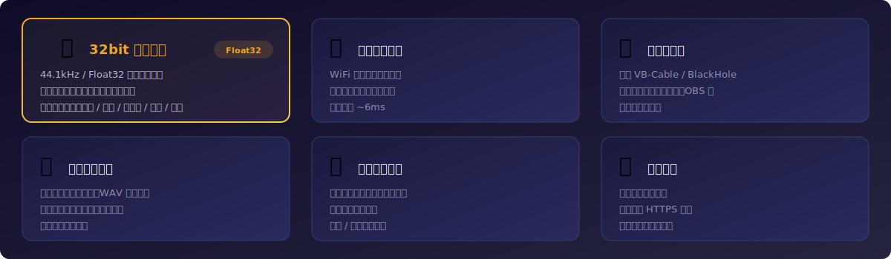

# Any Wireless Mic

将任意支持浏览器的设备变成电脑的无线麦克风，支持实时音频传输、录制和波形可视化。


[English](README.md) | **中文** | [更新日志](CHANGELOG_CN.md)

---

## 功能特性



### 核心功能
- **实时音频传输** - 通过 WiFi 局域网将音频实时传输到电脑，质量 1-100 可调
- **虚拟麦克风支持** - 输出到虚拟音频设备（VB-Cable / BlackHole），兼容任意应用
- **自动重采样** - 自动适配不同设备的采样率，无需手动配置
- **本地与远程录制** - 电脑端录制，手机端控制，保存为 WAV 格式
- **波形可视化** - 播放录音时显示音频波形，支持点击跳转

### 更多功能
- **远程文件管理** - 手机端浏览、播放、下载、删除录音文件
- **二维码连接** - 扫码即连，零配置
- **自动 HTTPS** - 自动生成自签名证书，确保浏览器可访问麦克风
- **设备选择** - 可选择音频输出设备，支持刷新设备列表
- **暗黑/明亮主题** - 现代化 GUI，支持主题切换
- **快捷键** - 空格播放/暂停，方向键快进/快退
- **安全删除** - 默认删除到回收站，可切换为永久删除

---

## 系统要求

| 平台 | 最低版本 |
|------|---------|
| Windows | Windows 10+ |
| macOS | macOS 10.15+ |

- Python 3.7+
- 一台支持现代浏览器的设备（手机、平板、笔记本），与电脑在同一 WiFi 网络

---

## 安装

```bash
pip install flask flask-socketio eventlet pyaudio ttkbootstrap qrcode pillow pyopenssl matplotlib numpy send2trash scipy
```

### 虚拟音频线缆（可选但推荐）

为了让其他应用（腾讯会议、OBS、Discord 等）能识别无线麦克风：

**Windows：** 安装 [VB-Audio Virtual Cable](https://vb-audio.com/Cable/)

**macOS：** 安装 [BlackHole](https://github.com/ExistentialAudio/BlackHole)

---

## 快速开始

1. 运行程序：
```bash
python src/手机麦克风输入.py
```

2. 在 GUI 中选择音频输出设备（如 "CABLE Input"）
3. 点击"开启服务"，界面会显示二维码和 URL
4. 用手机浏览器扫描二维码（确保在同一 WiFi 网络）
5. 接受自签名证书警告，点击麦克风按钮
6. 开始说话，音频会实时传输到电脑

---

## 音频质量设置

| 质量 | 模式 | 缓冲区 | 延迟 | 适用场景 |
|------|------|--------|------|----------|
| 1-10 | 低延迟 | 256 | ~6ms | 实时通话 |
| 11-30 | 流畅 | 512 | ~12ms | 日常使用 |
| 31-50 | 平衡 | 1024 | ~23ms | 推荐默认 |
| 51-75 | 稳定 | 2048 | ~46ms | 网络不稳定 |
| 76-100 | 高稳定 | 4096 | ~93ms | 弱网络环境 |

---

## 快捷键

| 快捷键 | 功能 |
|--------|------|
| 空格 | 播放/暂停 |
| ← | 后退 5% |
| → | 前进 5% |

---

## 项目结构

```
Any-Wireless-Mic/
├── src/
│   ├── 手机麦克风输入.py      # 主程序
│   ├── templates/
│   │   └── index.html         # 网页端界面
│   └── 免费版/                # 免费版
├── assets/                    # 视觉素材
├── README.md                  # 英文文档
├── README_CN.md               # 中文文档
├── CHANGELOG.md               # 英文更新日志
├── CHANGELOG_CN.md            # 中文更新日志
├── LICENSE                    # Apache License 2.0
└── VERSION                    # 版本文件
```

---

## 技术栈

| 类别 | 技术 |
|-----|------|
| 后端 | Flask + Flask-SocketIO (WebSocket) |
| 前端 | HTML5 + Web Audio API |
| 音频 | PyAudio |
| GUI | ttkbootstrap |
| 可视化 | Matplotlib |
| 安全 | pyOpenSSL (自签名 HTTPS) |

---

## 许可证

[Apache License 2.0](LICENSE)

## 作者

**Tonyhzk**

- GitHub: [@Tonyhzk](https://github.com/Tonyhzk)
- 项目地址: [Any-Wireless-Mic](https://github.com/Tonyhzk/Any-Wireless-Mic)

<div align="center">

如果这个项目对你有帮助，欢迎给个 Star！

</div>