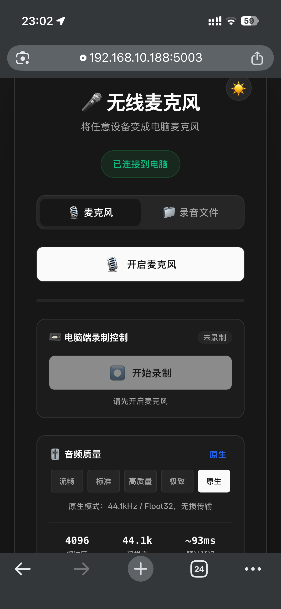
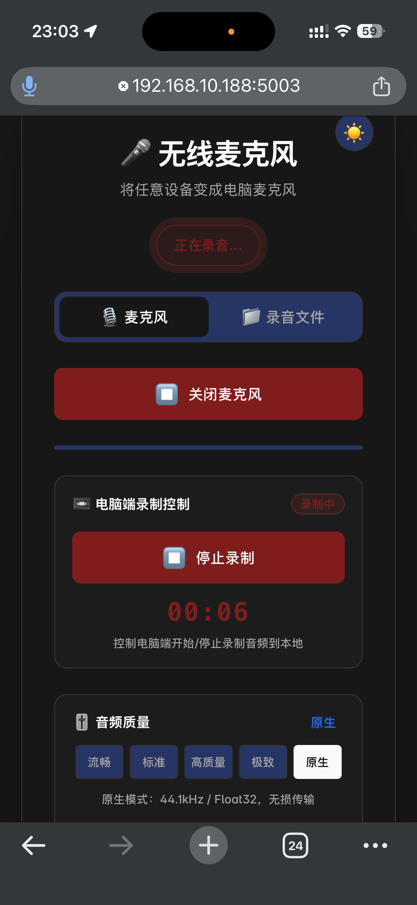
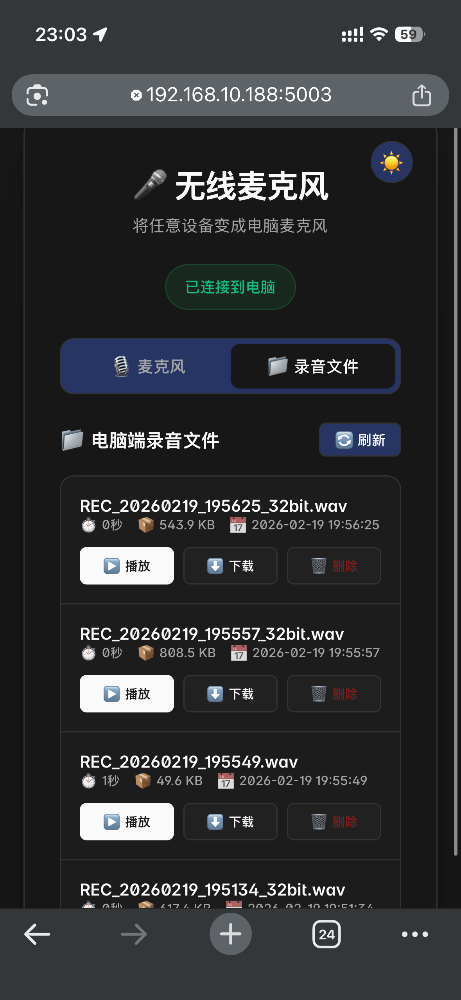
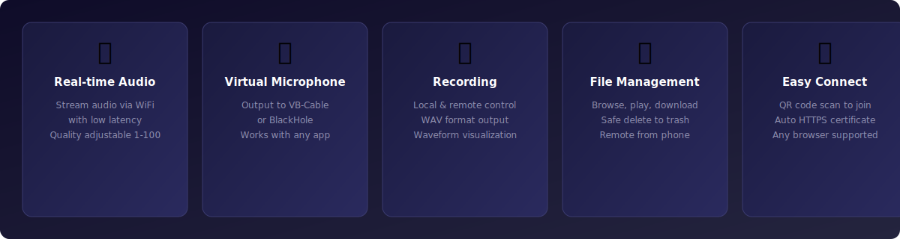

# Any Wireless Mic

Turn any device with a browser into a wireless microphone for your PC via LAN. Works with DaVinci Resolve and other professional software for direct phone-to-PC audio recording.


**English** | [中文](README.md) | [Changelog](CHANGELOG.md)

---

## Preview

### Desktop


### Mobile


### Mobile Recording


### Mobile File Management


### DaVinci Resolve Recording


---

## Features



### Core Features
- **Real-time Audio Streaming** - Stream audio from any device to your PC via WiFi with adjustable quality (1-100)
- **Virtual Microphone Support** - Output to virtual audio devices (VB-Cable / BlackHole) for use in any application
- **DaVinci Resolve Recording** - Use your phone as a wireless mic to record directly into DaVinci Resolve and other professional software
- **Auto Resampling** - Automatically adapts to different device sample rates
- **Local & Remote Recording** - Record audio on PC, control from phone, save as WAV
- **Waveform Visualization** - View audio waveforms during playback with click-to-seek

### Additional Features
- **Remote File Management** - Browse, play, download, and delete recordings from your phone
- **QR Code Connection** - Scan to connect, zero configuration needed
- **Auto HTTPS** - Self-signed certificate for browser microphone access
- **Device Selection** - Choose audio output device with refresh support
- **Dark / Light Theme** - Modern GUI with theme switching
- **Keyboard Shortcuts** - Space to play/pause, arrow keys to seek
- **Safe Delete** - Delete to trash (default) or permanent delete

---

## System Requirements

| Platform | Minimum Version |
|----------|-----------------|
| Windows | Windows 10+ |
| macOS | macOS 10.15+ |

- Python 3.7+
- A device with a modern browser on the same WiFi network

---

## Installation

```bash
pip install flask flask-socketio eventlet pyaudio ttkbootstrap qrcode pillow pyopenssl matplotlib numpy send2trash scipy
```

### Virtual Audio Cable (Optional but Recommended)

To use as a microphone in other apps (DaVinci Resolve, Zoom, OBS, Discord, etc.), install a virtual audio cable:

**Windows:**

Install [VB-Audio Virtual Cable](https://vb-audio.com/Cable/)

1. Download and run the installer, restart after installation
2. Select `CABLE Input` as the output device in this app
3. Select `CABLE Output` as the microphone input in DaVinci Resolve / Zoom / etc.

**macOS:**

Install [BlackHole](https://existential.audio/blackhole/)

```bash
brew install blackhole-2ch
```

1. After installation, open Audio MIDI Setup
2. Select `BlackHole 2ch` as the output device in this app
3. Select `BlackHole 2ch` as the microphone input in DaVinci Resolve / Zoom / etc.

**Linux:**

Use PulseAudio built-in virtual devices:

```bash
pactl load-module module-null-sink sink_name=VirtualMic sink_properties=device.description=VirtualMic
pactl load-module module-remap-source master=VirtualMic.monitor source_name=VirtualMicInput source_properties=device.description=VirtualMicInput
```

1. Select `VirtualMic` as the output device in this app
2. Select `VirtualMicInput` as the microphone input in other apps

---

## Quick Start

1. Run the application:
```bash
python src/main.py
```

2. Select your audio output device (e.g. "CABLE Input") in the GUI
3. Click "Start Service" - a QR code and URL will appear
4. Scan the QR code with your phone's browser (same WiFi network)
5. Accept the self-signed certificate warning, then tap the microphone button
6. Start speaking - audio streams to your PC in real-time

---

## Audio Quality Settings

| Quality | Mode | Buffer | Latency | Use Case |
|---------|------|--------|---------|----------|
| 1-10 | Low Latency | 256 | ~6ms | Real-time calls |
| 11-30 | Smooth | 512 | ~12ms | Daily use |
| 31-50 | Balanced | 1024 | ~23ms | Recommended default |
| 51-75 | Stable | 2048 | ~46ms | Unstable network |
| 76-100 | High Stability | 4096 | ~93ms | Weak network |

---

## Keyboard Shortcuts

| Shortcut | Action |
|----------|--------|
| Space | Play / Pause |
| ← | Rewind 5% |
| → | Forward 5% |

---

## Project Structure

```
Any-Wireless-Mic/
├── src/
│   ├── main.py               # Entry point
│   ├── config.py              # Configuration management
│   ├── audio/                 # Audio engine & player
│   ├── server/                # Flask server & SSL cert
│   ├── ui/                    # GUI (ttkbootstrap)
│   ├── web/                   # Web client (HTML)
│   └── assets/                # Icons
├── assets/                    # Visual assets
├── README.md                  # Chinese documentation (default)
├── README_EN.md               # English documentation
├── CHANGELOG.md               # English changelog
├── CHANGELOG_CN.md            # Chinese changelog
├── LICENSE                    # Apache License 2.0
└── VERSION                    # Version file
```

---

## Tech Stack

| Category | Technology |
|----------|-----------|
| Backend | Flask + Flask-SocketIO (WebSocket) |
| Frontend | HTML5 + Web Audio API |
| Audio | PyAudio |
| GUI | ttkbootstrap |
| Visualization | Matplotlib |
| Security | pyOpenSSL (self-signed HTTPS) |

---

## License

[Apache License 2.0](LICENSE)

## Author

**Tonyhzk**

- GitHub: [@Tonyhzk](https://github.com/Tonyhzk)
- Project: [Any-Wireless-Mic](https://github.com/Tonyhzk/Any-Wireless-Mic)

<div align="center">

If this project helps you, please give it a Star!

</div>